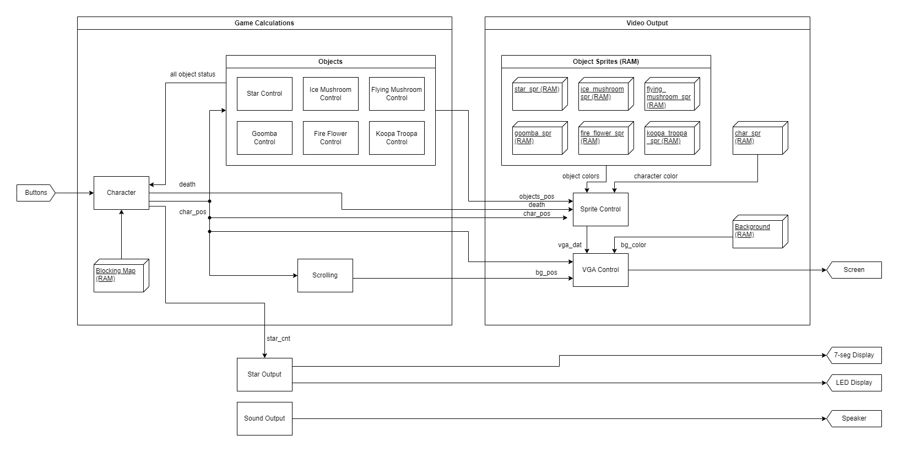

# FPGA Mario: Except Everything is Annoying
NYCU 2024 Spring Digital Lab EEEC10005 Final Project <br>
Group members: 黃仲璿、嚴得睿、張閔傑

This is an attempt to create an Mario-inspired 2D platformer game using the Nexys4 DDR FPGA board. The game level is homemade and carefully designed to convey the annoyance and irritation we've confronted during the development process of this project. 

Demonstration Video: https://www.youtube.com/watch?v=juEwY00mkc4 <br>


## System Specification
- FPGA Board: Nexys4 DDR
- VGA Screen
- Speaker


## System Architecture


- Input Controls
	- On-board Buttons
- Game Calculations
	- Character
		> Reads button inputs to move character position (`char_pos`) and checks if movement is legal using `Blocking Map`.
  - Scrolling
    > Update frame position (`bg_pos`) to keep character within the screen.
  - Objects
    > Calculate interactions between the character and objects.
  - Blocking Map (RAM)
    > Stores where the character is not allowed to enter (e.g. walls, floor, etc)
- Video Output
	- Sprite Control
		> Read color data of each character / object and passes the data to `VGA Control`.
 	- VGA Control
		> Renders all sprites and background to output onto the screen.
  - Background (RAM)
    > Stores color data of the background image.
  - Char_spr, star_spr, goomba_spr... (RAM)
    > Stores color data of character and each object's sprite image.
- Sound Output
  > Plays background music using a speaker.
- Star Output
	- On-board Seven-segment Display
		> Displays game status (number of stars collected). <br>
  - On-board LED
    > LED series displays a light show marquee when the player completes the game.


## Video Processor Development
### Literature Review
- CRT-based VGA
- 640 x 480 pixels, 60Hz refresh rate
- RGB color code (4-bit per color) -> 12-bit per pixel


### Convert image files from JPG/JPEG/PNG to COE
#### 24-bit RGB JPG to 12-bit RGB COE
- Convert JPG file to 24-bit BMP file (online converter)
  - 24-bit means RGB color code, 8-bit per color (ex. red = ff0000)
  
- Convert `.bmp` file to `.coe` file (BMP2Mif desktop app)<br>
  

- Convert `.coe` file from 24-bit to 12-bit using regex (8-bit * 3  ->  4-bit * 3)
  - *Under ubuntu command line*
  - run command `sed 's/.//6' filename.coe > newFile_1.coe`      (ex. ff0000 -> ff000)
  - run command `sed 's/.//4' newFile_1.coe > newFile_2.coe`     (ex. ff000  ->  ff00)
  - run command `sed 's/.//2' newFile_2.coe > finalFileName.coe` (ex. ff00   ->   f00)
  - replace first two rows with
    ```
    memory_initialization_radix = 16;
    memory_initialization_vector =
    ```

However, a single 12-bit RGB COE file of a 640x480 picture fills the block memory of the Nexys4 DDR up to approximately 70%.
This means we would have to compress the size of pictures if we want to achieve horizontal scrolling background. <br>

_Note: Python 3.8 and the PILLOW library are required_

#### 32-bit PNG to 9-bit COE
> 32-bit is RGBA color coding, 8-bit for each variable.

Using the Python library Image (from PIL), extract the RGBA value (`A` = opacity) of each pixel from the PNG file.
Convert the 8-bit R/G/B values to 3-bit binary values (abort value of `A`), then concatenate the three into a 9-bit value.
Write the 9-bit value of each pixel into an output COE file.

- Save PNG file in the same directory as `32bitpng_to_9bitcoe.py` (the converter)
- At windows cmd, run `$ python 32bitpng_to_9bitcoe.py`
- Type in the filename of the PNG file
- Receive COE file under the same directory named `<in_filename>_9bit.coe`

Background image raw file:
 <br>

Output result:
 <br>

_Notice how the colors significantly differs from the original PNG file. This is because only the 3 most significant bits of R, G, and B (originally 8-bits each) are concatenated. This brutal solution causes an obvious color distortion._


#### Color Scheme Fix
The simple PNG-to-9bit-COE solution previously presented has a serious distortion in color convertion. Therefore a linear transformation method is introduced here to preserve the color scheme of the original image to the maximum extend. The idea is to have the RGB values between 8-bit (0 ~ 255) be linearly mapped to 3-bit (0 ~ 7). Thus the equation: $y = \frac{7x}{255}$, where x is the original 8-bit value and y is the corresponding 3-bit value. <br>
Although this convertion method still cannot convert the color scheme completely due to the limited color palette of 9-bit RGB, it did create a much better portrayl of the original image.

Output result:
 <br>

##### Reference
- https://stackoverflow.com/questions/12807669/how-to-convert-an-rgb-color-to-the-closest-matching-8-bit-color?fbclid=IwZXh0bgNhZW0CMTAAAR2quU1vXapxB_7i4PH6pAtKHepgDO9oD6pAL2jqr80RxePaxBntHD00WGc_aem_ATH-CjI_HFjCCoazRLQmv4BbaiWMK8Nxit4m6MyYDwNAJm2gAfIcPWPK-v-Pvxw9WEGhIZ2T_s7TtT72Q-HeeF6N <br>
- https://stackoverflow.com/questions/138250/how-to-read-the-rgb-value-of-a-given-pixel-in-python <br>
- https://www.browserstack.com/guide/how-to-use-css-rgba <br>
- https://stackoverflow.com/questions/5676646/how-can-i-fill-out-a-python-string-with-spaces <br>
- https://www.codeproject.com/Questions/1077234/How-to-convert-a-bit-rgb-to-bit-rgb <br>


### VGA from ROM
Create a VGA driver prototype that is able to print a image (saved in ROM) onto the screen.

- 100MHz to 25MHz using Xilinx IP Clocking Wizard
  - _Don't use homemade counter-based frequency divider or may cause severe clock jittering_
  - change `CLK_IN1` board interface from `custom` to `sys clock `
  - rename `clk_out1` to `clk_25mhz`
  - Primitive = `PLL`
  - output frequency request = `25MHz`
  - disable `reset`, `power_down`, and `locked`

- VRAM using Xilinx IP Block Memory Generator
  - interface type = `Native`
  - memory type = `Single Port ROM`
  - Enable Port Type = `always enabled`
  - Port A width = `12`  (∵ 4-bit per color)
  - Port A depth = `307200 (∵ 680 x 480 pixels)
  - Load init file = `.coe file location`

- top module: `VGA`
  - links modules together
  - feeds .coe file to `VGA_output` module

- VGA driving module: `VGA_output`
  - reads data from data input and scan-prints onto VGA screen


### VGA from VRAM (Video RAM)
In order to show sprites and other objects above the ROM background, a read-and-write VRAM should be constructed.
A VRAM is a *video buffer* that saves the rendered image ready to be shown on-screen.
This means that the `VRAM_ctrl` module should compare the positions and transparency of sprites to the background and
determine either the color of the sprite or the background should be saved to the VRAM at each pixel. <br>

- Reads `bg_pos` from `scrolling` module as the starting x position of the frame to scroll through the map as the character moves.
- 100MHz to 25MHz using Xilinx IP Clocking Wizard
  - _Don't use homemade counter-based frequency divider or may cause severe clock jittering_
  - change `CLK_IN1` board interface from `custom` to `sys clock `
  - Primitive = `PLL`
  - output frequency request = `25MHz`
  - disable `reset`, `power_down`, and `locked`

- VRAM using Xilinx IP Block Memory Generator
  - interface type = `Native` 
  - memory type = `True Dual Port RAM`
    > True Dual Port RAM: allows simultaneous read and write (4 data buses) <br>
    > Simple Dual Port RAM: can only read or write at the moment (2 data buses)
  - Enable Port Type = `always enabled`
  - Port A width = `9`  (∵ 3-bit per color)
  - Port A depth = `460800` (∵ 960 x 480 pixels)
  - Load init file = `.coe file location`
  - *Additional output* `vga_end`: outputs a pulse signal when finish printing whole screen


### Sprite
Overlays movable sprites on top of VRAM.

- Reads the current VGA printing coordinates, sprite on-screen coordinates, sprite enable, and sprite RAM.
- Checks if the sprite is within screen boundary (aka `block`)
- Sprite RAM using Xilinx IP Block Memory Generator
  - interface type = `Native` 
  - memory type = `Single Port RAM`
  - Enable Port Type = `always enabled`
  - Port A width = `9`  (∵ 3-bit per color)
  - Port A depth = m * n (∵ m * n pixels)
  - Load init file = `.coe file location`
  - *Additional output* `vga_end`: outputs a pulse signal when finish printing whole screen
- Compares sprite with vram to decide which color data to print onto screen


## Internal Game Calculations Development
### Character Movement and Control
Use buttons on Nexys4 DDR to control character movement.

- Pin mappings (using 2hz to check the input):
  - Up (jump) = `M18`
  - Left = `P17`
  - Right = `M17`
- Coordinates (upper-right corner of character) are *absolute coordinates* (stored in the format of x and y relative of the whole background)
- the operation of X coordinate and Y coordinate is written seperately because there's a huge difference between moving vertically and horizontally due to the presence of gravity, also to avoid multi-driven problem
### Gravity mechanism
  - Character will fall if there's no blocking object (ex. floor or bricks) below it
  - Realized through finite state machine
  - state graph:
  
  - there's some additional mechanisms to ensure the correctness of transport and blocking, which will be explained later
  - corresponding action of each state (if no additional mechanisms were triggered):
      - IDLE: do nothing
      - FALLING: fall by one pixel each clock cycle, if it doesn't encounter any blocking object, it will keep falling because of the presence of gravity
      - JUMPING: rise by one pixel each clock cycle, the total height of one jump is controled by a counter
      
```
	if(counter_jump==10'd64) begin //control the height of each jump
		counter_jump<=10'd0;
	state<=FALLING; //if the jumping action is ended, it should fall due to gravity
		end
	else begin
		counter_jump<=counter_jump+10'd1;
	end
```
 
### Dealing with Blocking 
  - goal: unable mario from passing through some blocking objects (ground, wall...)
  - read the "blocking map" from RAM, for each pixel, there's a bit indicates whether it's a legal location where mario can access (0 = character can walk through; 1 = character cannot walk through)
```
    blk_mem_gen_2 blocking_ram (
        .clka(sys_clk),
        
        .addra({10'b0, char_X}+{10'b0, char_Y}*20'd960),  //the current location of mario
        .douta(block)
    );
```
  - I have tried some different methods and thoughts during the development
 #### Method 1 
  - try to "pre-read", i.e. try to get the status of next pixel in four direction to determine if mario can pass through those pixel before it move
  - I try to use FSM to transfer between check up/down/left/right pixel of current location
```
parameter REST = 3'd0, U = 3'd1, D = 3'd2, L = 3'd3, R = 3'd4;
reg [2:0] state_check_blocking=3'd0;
reg [9:0] check_X;
reg [9:0] check_Y;

    blk_mem_gen_2 blocking_ram (
        .clka(sys_clk),

        .addra({10'b0, check_X}+{10'b0, check_Y}*20'd960), //read the pixel we want to check
        .douta(block)
    );
```
```
    //take the "check upper" for example, rest of the four directions is written in a same fashion
    U: begin 
	if((char_Y-10'b1)>=map_u_lim) begin
		check_X<=char_X;
		check_Y<=char_Y-10'b1; //check the pixel: (current_char_X, current_char_Y-1)
		if(block) upward<=1'b0;  //if encounter blocking object, lock the ability to go upward
		else upward<=1'b1;
	end
    end
```
  - result: failed, it won't move at all. Maybe there's some clock issue in my implementation.
    
 #### Method 2 
  - I decided to design the mechanism base on the fact that I can only get the information of "the current pixel", I adopted a method which is "record the last movement, once encounter block, cannot go further"
    - for example: if mario move forward and the next pixel is a blocking object, once it arrives the pixel, it cannot move forward again until it move backward
```
        if(block) begin //"lock"
		if(last_mov[3]) upward=1'b0;
		if(last_mov[2]) downward=1'b0;
		if(last_mov[1]) backward=1'b0;
		if(last_mov[0]) forward=1'b0;
	end
	else begin //"unlock"
		if(last_mov[3]) downward=1'b1;
		if(last_mov[2]) upward=1'b1;
		if(last_mov[1]) forward=1'b1;
		if(last_mov[0]) backward=1'b1;
	end
```
```
        //need to check if the direction is lock or not before every movement
        if(char_X==map_l_lim) begin
            char_X<=char_X; //cannot move anymore
        end
	else if(mov[1]==1'b1 && backward) begin
		char_X<=char_X-10'd1;
		last_mov[1]<=1'b1; 
		last_mov[0]<=1'b0;
	end
	else if(backward==1'b0 && last_backward==1'b1) begin
		char_X<=char_X+10'd1;
	end
```
 - Result: failed, mario will stuck in the ground due to the presence of gravity system (if we are standing on a ground and want to move forward and backward, we can only move one pixel and it will be locked)

#### Final Method
  - to solve the problem of method 2, I decided to add a "send back" mechanism, which is adding a "send back" mechanism and alter the record of past information from "record the last movement" to "record the last location (absolute coordinate)". If it encounter a blocking pixel, it will be sent back to the last position.
```
	//take move backward for example
        if(char_X==map_l_lim) begin
		char_X<=char_X; //cannot move anymore
	end
	else if(mov[1]==1'b1) begin
		if(block & ~transmit) begin 
			char_X<=last_X; //send back!!!
			send_back_lr<=1'b1; //will be mentioned later
		end
		else begin
			transmit<=1'b0;
			last_X<=char_X; //record previous X
			char_X<=char_X-10'd1; //move
		end
	end
```
  - but there's a small problem: "if mario was sent back horizontally, the vertical movement's status will remain IDLE, so the gravity system is invalid, it will float on the air"
  - to solve this problem, I design a bit call "send_back_lr" to record if there's some "horizontally send back" takes place. If there's some "horizontally send back", I will open the gravity system, i.e. change the FSM to FALLING state.
```
        //in the segment of horizontally movement control
        if(block) begin
		send_back_lr<=1'b1;
	end
	else begin
		send_back_lr<=1'b0;
	end
```
```
        //in the segment of vertically movement control (FSM state logic)
        IDLE: begin
		if(block && ~transmit) char_Y<=last_Y;
		else char_Y<=char_Y;
				
		if(char_X!=last_X && ~transmit) downward<=1'b1;
		else if(send_back_lr) downward<=1'b1; //open the gravity system
	end
```
 - result: succeed
    
### Transport Mechanism
  - store all absolute coordinate of each portal (door and pipe) by parameters
```
parameter door_A_X=10'd350, door_A_Y=10'd50, door_B_X=10'd55, door_B_Y=10'd25, door_C_X=10'd50, door_C_Y=10'd205;
```
  - using a "line" instead of a "point" to detect if mario triggered a portal
```
        else if((char_X>=door_A_X && char_X<door_A_X+10'd24) && char_Y==door_A_Y) begin //if mario is within the range, the transportation will take place
		transmit<=1'b1;
		char_X<=goomba_room_X;
	end
```

  - why I designed a "transmit" bit in our implementation?
    
    - I encountered a problem: mario will be send back and forth repeatedly
    - but why?
    - It seems that when mario was transported to the target, my gravity system will make it fall immediately. And when it first touch a blocking object (the ground), my blocking mechanism will send it back to "last location". But in this moment, the value of the register which store "the X coordinate of mario's last location" remains the coordinate of the portal, so the tragedy happens
    - solution:
    - simply turn off the "send back" mechanism of my blocking system until some horizontal movements happen
```
	else if(mov[0]==1'b1&& forward) begin
	        if(block & ~transmit) begin //after transmit, the "send back mechanism" will be turned off temporary
		        char_X<=last_X;
			send_back_lr<=1'b1;
		end
		else begin
                        transmit<=1'b0; //turn on the "send back mechanism" again because there's some movement
			last_X<=char_X;
			char_X<=char_X+10'd1; 
		end
	end
```

### Screen Scroll
Scroll screen as the character moves on the screen to prevent character from leaving the screen, and to access extensive areas of the map.

- Keep character within the center 1/3 area of the screen
- Update frame coordinates (bg_pos) on full map (60hz) depending on character's x position (get it from char.v)
```
	if(bg_pos<10'd325 && char_X>=bg_pos+10'd270) begin
		bg_pos<=bg_pos+10'd1;
	end
	if(bg_pos>10'd0 && char_X<=bg_pos+10'd90) begin
		bg_pos<=bg_pos-10'd1;
	end
```
- Implement `bg_pos` into VGA_CTRL
  - Method 1: Direct vram address calculation via coordinate multiplication 
    - `vram_adr <= bg_pos + pixel_x + pixel_y * 19'd960` (at clock speed of 25mhz)
    > Interesting observation note:
    > It is known that the calculation of multiplication take more than one clock cycle to due its complexity.
    > Thus originally this method was expected to malfunction and was only tested out of pure curiosity when debugging.
    > However, it is observed that this method was able to achieve the same result as Method 2.
    > After discussing with the teaching assistant, the speculated explaination of this phenomenom is that:
    > 1. All main functions are run and 25mhz while the system clock is 100mhz, overclocking creates a range of "buffer clock cycles" so that even though it takes multiple 100mhz clock cycles to perform multiplication, it still remains under 1 25mhz clock cycle.
    > 2. When implementing multiplication, Xilinx Vivado sacrifices circuit area of multiplication for efficiency to accelerate the number of clock cycles required
      
  - Method 2: Add 320 at every end-of-line (This method was chosen)
    - `if(hcount_r == hdat_end && vcount_r >= vdat_begin && vcount_r < vdat_end)   vram_adr <= vram_adr + 18'd320;`

      
### Creating Blocking Map
Create a RAM to record where the character are not allowed to enter.
0 = character can walk through; 1 = character cannot walk through.
- Landscape
  - Background map
- Obstacles
  - Locations of other npcs (ex. goombas)

#### Creating Landscape
Convert the 32-bit PNG background file into a 1-bit COE file by reading the RGBA value of each pixel. If pixel is transparent (`A` == 0), set the pixel to be 0 (character allowed), othewise set to 0 (character not allowed).
- Save PNG file in the same directory as `32bitpng_to_1bit_landscape.py` (the converter)
- At windows cmd, run `$ python 32bitpng_to_1bit_landscape.py`
- Type in the filename of the PNG file
- Receive COE file under the same directory named `<in_filename>_1bitcoe_landscape.coe`


## Designing Level Map
### WiiBaFu: Extract New Super Mario Wii Game Data
https://github.com/larsenv/Wii-Backup-Fusion <br>
_Disclaimer: pirating games are *NOT* encouraged. This project only uses decoded game level files as reference data for sprite images and level map designing._

- Download WBFS file (wii game file format) of New Super Mario Wii Game
- Extracted result is a folder of all game datas

### Reggie!: Edit Level Map
https://horizon.miraheze.org/wiki/Reggie_Level_Editor <br>
Wii game level data reader and editor. Allows customizations using sprites and tiles from the game.

- Design our own level
- Take level screenshot (PNG) <br>
   <br>
- For background file, don't hide background (sky color) <br>
   <br>
- For landscape file, hide background (sky color becomes transparent <br>
   <br>

Reggie screenshot crops an extra 20 pixels on each side, and Windows automatically zooms any screenshot files to 1.5x of its original resolution. So we need to crop and resize the screenshot PNG file before converting into COE. <br>
https://www.iloveimg.com/crop-image/crop-png

### Level Map Design Explanation
 <br>
There's a poisonous star, which is next to the goomba.
Take the rest of stars, then you win.
#### Objects
 <br>

#### Stage 1
 <br>
- Door A & Door B: Teleport to Goomba room
- Door C: teleport to Door D
- Door E: teleport to stage 2
- Pipe F: Teleport to (have flying_mashroom)? G : Goomba room

#### Stage 2
 <br>
- Pipe A & Pipe C: teleport to Goomba room
- Pipe B: teleport to D
- Pipe E & Pipe F: teleport to Goomba room
- Pipe G: teleport to H


## Background Music Development
### Calculate How Long Each Note Should Last
 - In general, we can mainly categorize the notes in this sheet music into `quarter notes` and `eighth notes`.
 - This music's BPM is 180, which means it plays 180 quarter notes per minute, so every quarter notes lasts for 60s/180 = 0.33s. For convenience, we let it be 0.3s. Therefore the eighth note should last for 0.3s/2 = 0.15s. 
 - We must insert a break between the two notes, otherwise two consecutive eighth notes of the same pitch will sound like a quarter note. Thus we add a additional 0.05s break to distinguish two consecutive notes of the same pitch.
 - To sum up, every `quarter note` would last for 0.3s, followed by 0.05s break. Every `eighth note` would last for 0.15s, followed by 0.05s break.


### Calculate Every Pitch's Correspond Counter Number
- Every pitch come from a frequency divider whose input clock signal is 100MHz, so we must calculate the counter number to get the accurate frequency.
- Formula: 100M / pitch's frequency / 2
  - C4(261Hz):  `190839`
  - D4(293Hz):  `170068`
  - E4(329Hz):  `151515`
  - F4(349Hz):  `143266`
  - G4(391Hz):  `127551`
  - G4#(415Hz): `120481`
  - A4(440Hz):  `113636`
  - A4#(466Hz): `107296`
  - B4(493Hz):  `101215`
  - C5(523Hz):  `95602`
  - D5(587Hz):  `85178`
  - D5#(622Hz): `80385`
  - E5(659Hz):  `75873`
  - F5(698Hz):  `71633`
  - F5#(739Hz): `67658`
  - G5(783Hz):  `63776`
  - A5(880Hz):  `56818`
  - B5(987Hz):  `50658`
### Pitch Generator
- There are three important inputs
  - `counter`: Decide which pitch we want to play
  - `rest`: 1 for rest notes, 0 for regular notes
  - `eight`: 1 for eighth notes, 0 for quarter notes
- Two outputs
  - `next_note`: When a note is played to its full duration, `next_note` would toggle to 1, telling the top module proceed to the next note
  - `note`: the pitch we want to play
```
module note (input clk_100MHz,
              input [17:0] counter,
              input rest,
              input eight,
              output next_note,
              output note
);
```
- we set up a `beat_counter` which will increment by 1 whenever recieve a posedge clk_1000Hz signal. So, if the `eight` is 1, the `beat_counter` will count to 200 and return to 0 (0.15s sound output and 0.05s break). On the other hand, if the `eight` is 0, it will count to 350 and return to 0 (0.3s sound output and 0.05s break).
- sound output logic
```
assign note = clk_out & ~rest & ((eight & (beat_counter <= 150)) | (~eight & (beat_counter <= 300)));
```
### Top Module: A Finite State Machine
- A note is a state. In every state, we input different `counter`, `rest` and `eight` to generate the specific pitch.
  - Totally 188 states...
```
always@(*)
  begin
    case(state)
      //first section
      10'd0: begin //eighth E5
               counter = 18'd75873;
               rest = 0;
               eight = 1;             
             end
      10'd1: begin  //eighth E5
               counter = 18'd75873;
               rest = 0;
               eight = 1;     
             end
            .
            .
            .
            .
      10'd187: begin  //eighth G4
                 counter = 18'd127551;
                 rest = 0;
                 eight = 1;
               end
      10'd188: begin  //quarter rest
                 counter = 18'd0;
                 rest = 1;
                 eight = 0;
               end
    endcase
  end
```

- Next State Logic
  ```
  always@(posedge next_note)
  begin
    if(state == 188)
      state <= 0;
    else
      state <= state + 1;
  end
  ```


## Objects Development
- All objects can be classified into two categories: those that can kill the player and those that cannot kill the player.
  - Those can kill the player: `Goomba`, `Goomba tower`, `koopa troopa` and `poison star`.
  - Those cannot kill the player: `Fire flower`, `Ice mashroom`, `flying mashroom` and `star1~5`.
- In every objects module, the inputs are `sys_clk`, `char_X` and `char_Y`. outputs are `objects_X`, `objects_Y` and `en`, and some special signals.
  - `objects_X`, `objects_Y` and `en` would be inputs of `SPR_CTRL`, special signal would be inputs of `Char`.
  - *IMPORTANT: output RELATIVE X_COORDINATE to `SPR_CTRL`* or objects will moving with screen scrolling.
### Game Mechanics of Objects
 #### Goomba Tower
  - Automatically moving back and forth in the Goomba room
    - moving range: 100 pixels
  - whenever touching the Goomba tower, send a `death` signal to `char`.
```
assign death = ((char_X + 10'd12 == goomba_tower_x_r) | (char_X == goomba_tower_x_r + 10'd12)) & (char_Y > goomba_tower_y_r) ;
```
(Either one side of character touch the Goomba tower and character is below the Goomba tower)
#### Goomba and Koopa Troopa
 - standing statically, wait for Mario to step on or touch them.
   - send a death signal if Mario touching them from to sides.
   - If Mario step on their head, they will die and then disappear.
```
assign death = ((char_X + 10'd12 == goomba_x_r) | (char_X == goomba_x_r + 10'd12)) & (char_Y == goomba_y_r) & enable;
```
(Either one side of character is touched, the objects and character are in the same height)
```
else if( (((char_X >= goomba_x_r) && (char_X <= goomba_x_r + 10'd12)) || ((char_X + 10'd12 >= goomba_x_r) && (char_X + 10'd12 <= goomba_x_r + 10'd12))) && (char_Y + 10'd12 == goomba_y_r) )
       enable <= 1'b0;
```
(char_X is within the range of objects and character's bottom is equal to the objects' top)
#### Poison Star
- kill the player no matter which side the player touch it.
```
 assign death =  ((((char_X >= poison_star_x_r) && (char_X <= poison_star_x_r + 10'd12)) || ((char_X + 10'd12 >= poison_star_x_r) && (char_X + 10'd12 <= poison_star_x_r + 10'd12)))) & ((((char_Y >= poison_star_y_r) && (char_Y <= poison_star_y_r + 10'd12)) || ((char_Y + 10'd12 >= poison_star_y_r) && (char_Y + 10'd12 <= poison_star_y_r + 10'd12))));
```
#### Stars, Fire Flower, Flying Mushroom and Ice Mushroom
- `touch` is initialize to 0. when Mario touch these objects, toggle `touch` to 1, and keep output 1 until detect negedge `RST_N`.
```
always@(posedge sys_clk or negedge RST_N)
    begin
      if(!RST_N)
        begin
          enable <= 1'b1;
          touch <= 1'b0;
        end
      else if( ((((char_X >= star1_x_r) && (char_X <= star1_x_r + 10'd12)) || ((char_X + 10'd12 >= star1_x_r) && (char_X + 10'd12 <= star1_x_r + 10'd12)))) & ((((char_Y >= star1_y_r) && (char_Y <= star1_y_r + 10'd12)) || ((char_Y + 10'd12 >= star1_y_r) && (char_Y + 10'd12 <= star1_y_r + 10'd12)))) ) 
        begin 
          enable <= 1'b0;
          touch <= 1'b1;
        end
      else
        touch <= touch;
    end
```


## Result and Conclusion
In this project, we realised a Mario-inspired FPGA-based horizontal scrolling 2D platform game by combining VGA output, image conversion, sound and on-board outputs, and internal game calculations. All image files are converted into 9-bit RGB color code format and stored within the BRAM of the Nexys4 DDR FPGA. This project provided a comprehensive challenge for us to utilize everything we learned in this course and even pushed us to learn new knowledge such as VGA timing and register delays.

Demonstration Video: https://www.youtube.com/watch?v=juEwY00mkc4

We are aware that this project has a lot of potential improvements due to time pressure. For example, we originally planned to add a sprite with the words "Course Clear" or "Mario Clear" to show when the player completes the level. However the idea was ditched since there wasn't enough space left in the BRAM and we didn't have time to switch the storage system from BRAM to Flash. Another potential amendment is the collision system. We didn't have enough time to fine-tune the collision calculations, so Mario can be seen to sometimes appear within walls. Though this doesn't much affect the overall gameplay, but fixing this slight bug could improve the user experience.


## Discussion
During the development process of this project, we've encountered several bugs that are tricky yet interesting. These bugs often imply certain flaws or details we overlooked.

### VGA Sync Timing Issues
VGA output relies on two clocking signals: horizontal sync (`VGA_HS`) and vertical sync (`VGA_VS`). These two signals help synchronize VGA output and are determined by the coordinates of the printing pointer (`hcount` and `vcount` in our source code). By examining the VGA timing diagram and the industrial standard for 640x480 resolution, it is obvious that the `VGA_HS` should be pulled high when `hcount > VGA_HS_end`, and `VGA_VS` should be pulled high when `vcount > VGA_VS_end`  (`VGA_HS_end = 10'd95` and `VGA_VS_end = 10'd1` by industrial standards). At first glance this appear to be a simple combinational logic. However, when attempting to assign `VGA_HS` and `VGA_VS` using combinational logic, the VGA timing signals become completely jammed and would output an incorrect mashed-up image. Although unsure about the exact reason behind this issue, we speculated that this might be caused by unstable signals due to combinational logic. So, sequential logic was tested. To our surprise, simply reconstructing the logic using an always-block solved the abnormal timing issue. Our hypothesis is that by utilizing flip-flops, this method guarantees that both signals can only be altered synchronously with each other and the 25 MHz clock that were used for all internal calculations.


### 24-bit to 9-bit Color Compression Data Loss
As previously mentioned, our first attempt to compress the image data from 24-bit to 9-bit failed and would output a red-toned image. We originally did not suspect the bug to be within the file conversion python code, but instead believed firmly that this must be caused by VGA timing issues because the VGA sync timing issue previously mentioned resulted in a similar red-toned screen. However when we inspected the converted COE file, we figured that our program was outputting exactly as the COE file. It turns out that the problem was caused by the unthoughtful trimming and concatenation of color data bits. We then switched to a linear tranformation between 24-bit and 9-bit color data. The result was closer to the original image in terms of contrast and relative color, but the overall color scheme lost a lot of color detail. For example, the portal doors used to have a lot more details, but now appear to be mearly a dark brown box. This is because 9-bit color coding can only provide 512 different colors, and linearly matching the 24-bit raw file to such loses a considerable amount of coloring details. But overall the overall color reamins clear and the appearance doesn't look too weird.


### Sprite Render Delay
When first attemping to achieve the mechanism of multi-sprite display, we used a sprite controlling module for each object and character and then compare all the color datas in the top module. However, this resulted in a severe error where the sprites would appear in the correct position with a correct color, but the background image was completely jammed. After consulting seniors, we figured the reason behind this bug is register-caused delays. In this method, the number of registers the color from sprites data passes through is different between sprites and background. This implies that at the final comparison to decide what color to output, the MUX would be compairing the color data of multiple sprites of the current pixel with the color data of the background image of a different pixel. This is why the sprites appear to be unaffected while the background is scrambled. The solution is to have unify the number of registers every color data pass through to eliminate the delay.

Demonstration of the scrambled background <br>
 <br>


Concept explanation diagram on register-caused delays <br>
 <br>
_*Blue number indicates which pixel the color data is representing_


## Reference
- https://projectf.io/posts/hardware-sprites/ <br>
- https://github.com/toivoh/rastrgrafx <br>
- https://cloudconvert.com/ <br>
- https://stackoverflow.com/questions/54592202/24-bit-rgb-to-12-bit-conversion <br>
- http://www.tinyvga.com/vga-timing <br>
- https://projectf.io/posts/video-timings-vga-720p-1080p/ <br>
- http://ca.olin.edu/2005/fpga_sprites/new_plan.htm <br>
- http://ca.olin.edu/2005/fpga_sprites/results.htm <br>
- https://support.xilinx.com/s/question/0D52E00006hpaYzSAI/difference-between-bram-configurations-tdp-vs-sdp?language=en_US <br>
